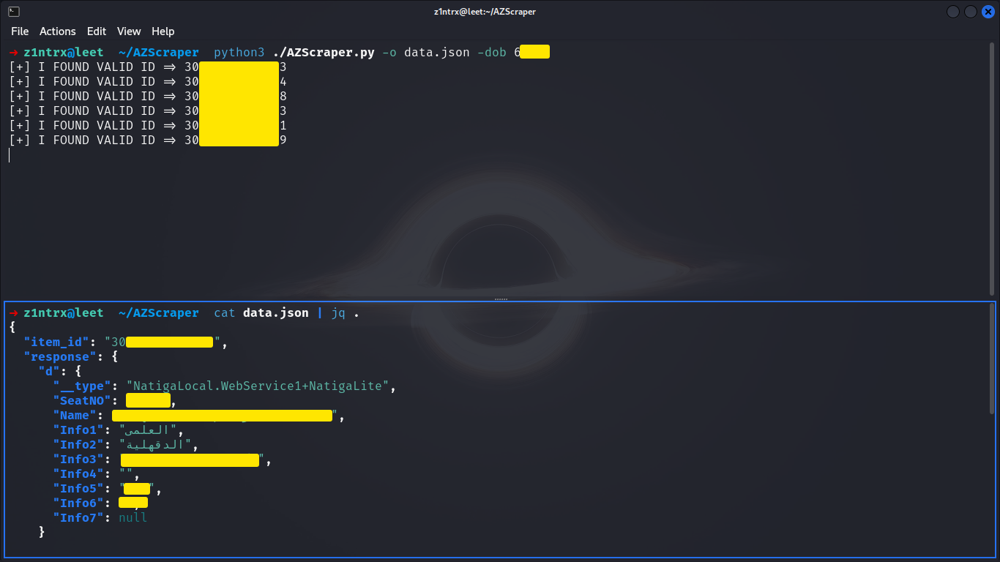

# Azhar Student Results Scraper

This Python script performs a brute-force attack to retrieve Azhar student results using just the date of birth. It constructs IDs by combining a base value (date of birth) with a brute-forced numeric suffix, then sends requests to the Azhar WebService to check for valid IDs.

## Features

- **Brute-Force Search**: Automatically generates and tests various IDs by combining a fixed date of birth with brute-forced numeric values.
- **Multithreaded Operation**: Utilizes multiple threads to speed up the brute-force process.
- **Output Results**: Saves valid results in a JSON file.

## Requirements

- Python 3.x
- `requests` library
- `argparse` library

## Installation

To install the required Python libraries, use:

```bash
pip install requests
```

## Usage

You can run the script with the following command:

```bash
python3 ./AZScraper.py -dob <DATE-of-BIRTH> -o <output_file>
```

### Arguments

- `-dob <DOB>`: Specify the date of birth in `YMMDD` format (e.g., `20304` for March 4, 2020). This value will be used as the base for generating item IDs.
- `-o <output_file>`: Specify the path to the output file where valid IDs and their responses will be saved in JSON format. Default is `ids-azhar-output.json`.

### Example

```bash
python3 ./AZScraper.py -dob 20304 -o results.json
```



This command will use `20304` as the base value and save the valid results to `results.json`.

## How It Works

1. **Generate Item IDs**: The script generates IDs by appending a brute-forced numeric value to the provided date of birth.
2. **Send Requests**: For each generated ID, the script sends a POST request to the Azhar WebService.
3. **Handle Responses**: If a valid response is received (i.e., the response contains data), the script saves the ID and response to the output file.
4. **Multithreading**: The script uses multiple threads to perform requests concurrently, speeding up the brute-force process.
5. **Graceful Shutdown**: The script handles interruptions (e.g., Ctrl+C) gracefully by stopping all threads and exiting cleanly.

## License

This script is provided for educational purposes only. Use it responsibly and ensure you have permission to test against the target service.

## Disclaimer

Unauthorized use of this script may be illegal or against the terms of service of the target website. Use it only for ethical and legal purposes.