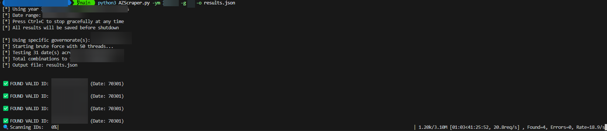

# Azhar Student Results Scraper

This enhanced Python script performs a brute-force attack to retrieve Azhar student results using flexible date inputs and targeted governorate selection. It constructs IDs by combining date values with governorate codes and sequential numbers, then sends requests to the Azhar WebService to check for valid IDs.

## Features

- **Flexible Date Input**: Accept either exact dates (YMMDD) or year/month combinations
- **Governorate Targeting**: Select specific Egyptian governorates instead of testing all 27
- **Multithreaded Operation**: Utilizes multiple threads for high-speed concurrent processing
- **Real-time Progress Bar**: Dynamic progress tracking with live statistics
- **Comprehensive Statistics**: Detailed performance metrics and success rates
- **JSON Output**: Saves valid results with metadata in structured JSON format
- **Input Validation**: Robust validation for dates, governorates, and parameters
- **Automatic Date Generation**: Handles leap years and month-specific day counts

## Requirements

- Python 3.x
- `requests` library
- `tqdm` library (for progress bars)
- `urllib3` library

## Installation

Install all required dependencies:

```bash
pip install -r requirements.txt
```

Or install individually:

```bash
pip install requests tqdm urllib3
```

## 📖 Usage

The tool supports multiple input methods for maximum flexibility:

### 🎯 Basic Syntax

```bash
python3 AZScraper.py [DATE_OPTIONS] [GOVERNORATE_OPTIONS] [OUTPUT_OPTIONS] [PERFORMANCE_OPTIONS]
```

### 📅 Date Input Methods

**Method 1: Exact Date (Original)**
```bash
python3 AZScraper.py -dob 70315 -o results.json
```

**Method 2: Year and Month (New!)**
```bash
python3 AZScraper.py -y 2007 -m 3 -o results.json
```

### 🗺️ Governorate Selection

**Test All Governorates (Default)**
```bash
python3 AZScraper.py -y 2007 -m 3 -o results.json
```

**Test Specific Governorates**
```bash
# Single governorate (Cairo)
python3 AZScraper.py -y 2007 -m 3 -g 01 -o cairo_results.json

# Multiple governorates (Cairo, Alexandria, Giza)
python3 AZScraper.py -y 2007 -m 3 -g 01 02 21 -o major_cities.json

# Delta region governorates
python3 AZScraper.py -y 2007 -m 3 -g 11 12 13 14 15 16 17 18 -o delta_results.json
```

### ⚙️ Command Line Arguments

| Argument | Description | Example | Default |
|----------|-------------|---------|----------|
| `-dob DOB` | Exact date of birth (YMMDD format) | `-dob 70315` | - |
| `-y, --year YEAR` | Birth year | `-y 2007` | - |
| `-m, --month MONTH` | Birth month (1-12) | `-m 3` | - |
| `-g GOV [GOV ...]` | Specific governorate ID(s) | `-g 01 12` | All governorates |
| `-o, --file FILE` | Output JSON file | `-o results.json` | `valid_responses.json` |
| `-t, --threads THREADS` | Number of threads | `-t 20` | `50` |
| `-h, --help` | Show help message | `-h` | - |

### 🌟 Advanced Examples

**High-Performance Targeted Search**
```bash
# Search March 2007 in Cairo with 20 threads
python3 AZScraper.py -y 2007 -m 3 -g 01 -t 20 -o cairo_march_2007.json
```

**Multi-Governorate Regional Search**
```bash
# Search Upper Egypt governorates for March 2007
python3 AZScraper.py -y 2007 -m 3 -g 25 26 27 28 29 31 -o upper_egypt.json
```

**Exact Date with Multiple Locations**
```bash
# Search specific date across major cities
python3 AZScraper.py -dob 70315 -g 01 02 21 -o major_cities_march15.json
```

### 📊 Progress Monitoring

The tool now features a **real-time progress bar** with live statistics:

```
🔍 Scanning IDs: 45%|████▌     | 1.40M/3.10M [02:15<02:45, 10.3kreq/s] Found=3, Errors=12, Rate=623.4/s
```

**Progress Information Includes:**
- ⏱️ Elapsed and estimated remaining time
- 📈 Current processing rate (requests/second)
- ✅ Number of valid IDs found
- ❌ Number of errors encountered
- 📊 Completion percentage

### 🛑 Graceful Shutdown

**Enhanced Ctrl+C Handling:**
- Press `Ctrl+C` at any time to stop gracefully
- All found results are automatically saved before shutdown
- Displays session statistics upon interruption
- No data loss - can resume with the same command

**Shutdown Information Displayed:**
```
🛑 Interrupt signal received (Ctrl+C)...
📊 Stopping gracefully and saving progress...

📈 Session Statistics:
   ⏱️  Runtime: 125.34 seconds
   🔍 Processed: 45,230 requests
   ✅ Found: 3 valid IDs
   ❌ Errors: 12
   ⚡ Rate: 360.8 requests/second

👋 Session terminated by user. Results saved to output file.
💡 Tip: You can resume by running the same command again.
```

### 🗂️ Governorate Reference

See `governorate_ids.md` for a complete list of governorate IDs and names.

**Popular Governorates:**
- `01` - Cairo (القاهرة)
- `02` - Alexandria (الإسكندرية)
- `21` - Giza (الجيزة)
- `12` - Dakahlia (الدقهلية)
- `13` - Sharqia (الشرقية)



## ⚙️ How It Works

### 🔢 ID Generation Algorithm

**ID Format**: `30{DATE}{GOVERNORATE}{SEQUENCE}`

- **Prefix**: Always `30`
- **Date**: YMMDD format (e.g., `70315` for March 15, 2007)
- **Governorate**: 2-digit governorate code (e.g., `01` for Cairo)
- **Sequence**: 5-digit sequential number (00000-99999)

**Example ID**: `3070315010001` = 30 + 70315 + 01 + 00001

### 🔄 Process Flow

1. **📅 Date Processing**:
   - Parse input (exact date or year/month)
   - Generate all possible dates for the time period
   - Handle leap years automatically

2. **🗺️ Governorate Selection**:
   - Use specified governorates or default to all 27
   - Validate governorate IDs against known Egyptian codes

3. **🎯 ID Generation**:
   - Combine each date with each governorate
   - Generate 100,000 sequential IDs per combination
   - Queue tasks for multithreaded processing

4. **🚀 Concurrent Execution**:
   - Distribute tasks across multiple worker threads
   - Send POST requests to Azhar WebService endpoint
   - Handle network errors with retry logic

5. **📊 Progress Tracking**:
   - Update real-time progress bar
   - Track success/error statistics
   - Calculate processing rates

6. **💾 Data Storage**:
   - Save valid responses to JSON file
   - Include metadata (base date, item ID, response)
   - Append results in real-time

7. **🛡️ Graceful Shutdown**:
   - Handle interruptions (Ctrl+C) cleanly
   - Stop all threads safely
   - Display final statistics

### 📊 Performance Optimization

- **Multithreading**: Up to 50 concurrent threads (configurable)
- **Connection Reuse**: Efficient HTTP connection management
- **Smart Targeting**: Governorate selection reduces search space by up to 96%
- **Progress Monitoring**: Real-time feedback prevents unnecessary waiting

## 🚀 Performance Comparison

| Scenario | Combinations | Estimated Time* | Improvement |
|----------|-------------|----------------|-------------|
| **All Governorates + Full Month** | 83,700,000 | ~23 hours | Baseline |
| **Single Governorate + Full Month** | 3,100,000 | ~52 minutes | **96% faster** |
| **3 Governorates + Full Month** | 9,300,000 | ~2.6 hours | **89% faster** |
| **Single Governorate + Exact Date** | 100,000 | ~1.7 minutes | **99.9% faster** |

*Estimated at 1000 requests/second average

### 📈 Efficiency Tips

1. **🎯 Target Specific Governorates**: Use `-g` to focus on likely locations
2. **⏱️ Use Exact Dates When Possible**: `-dob` is faster than `-ym`
3. **⚙️ Optimize Thread Count**: Start with `-t 20` and adjust based on your system
4. **💾 Monitor Progress**: Use the progress bar to estimate completion time

## 📁 Output Format

Results are saved in JSON format with the following structure:

```json
{
    "item_id": "3070315010001",
    "base_date": 70315,
    "response": {
        "d": {
            "student_data": "...",
            "results": "..."
        }
    }
}
```

## 📜 License

This script is provided for **educational purposes only**. Use it responsibly and ensure you have permission to test against the target service.

## ⚠️ Disclaimer

- Unauthorized use of this script may be **illegal** or against the terms of service of the target website
- Use it only for **ethical and legal purposes**
- The authors are not responsible for any misuse of this tool
- Always respect rate limits and server resources
- Consider the impact on the target service when running large-scale tests